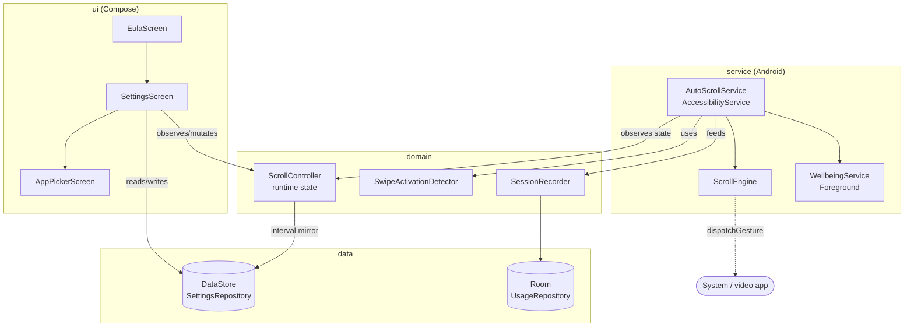
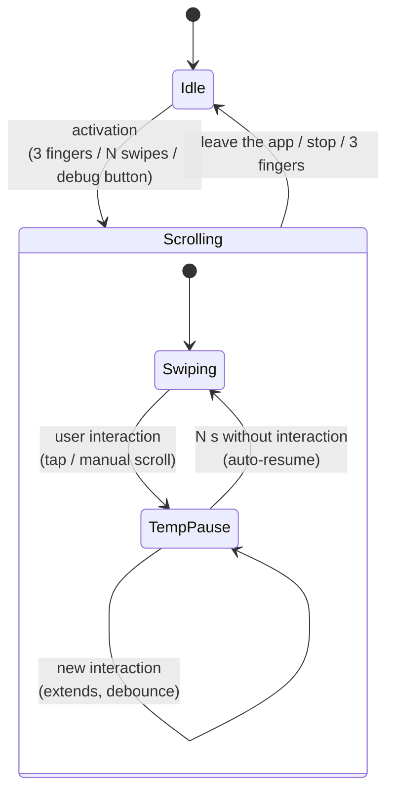

# Architecture — AutoScroller (Android)

> 🌐 [Español](ARCHITECTURE.md) · **English**

Technical documentation for the Android module. For *how to use* the app, see the
[README](../../README.en.md); for *how to test*, see [TESTING.md](../TESTING.en.md).

---

## 1. Overview

AutoScroller is an **accessibility and digital well-being** app that automates scrolling
in vertical video feeds (YouTube Shorts, TikTok, Reels). The core is an
**`AccessibilityService`** that injects system-level swipe gestures via
`dispatchGesture`, without accessing pixels or the network.

**Stack:** Kotlin · Jetpack Compose + Material 3 · Hilt (DI) · Coroutines/Flow ·
DataStore (preferences) · Room (usage history) · Navigation Compose.
AGP 9 / Gradle 9.5 / Kotlin 2.3 · minSdk 26 · target/compileSdk 36.

---

## 2. Layers and modules

The code follows a separation by responsibility (pragmatic Clean Architecture):

```
com.freelanzer.autoscroller
├── core/            Cross-cutting infrastructure
│   ├── di/          @ApplicationScope + CoroutineModule (process scope)
│   ├── time/        Injectable Clock (wall-clock) → testable on the JVM
│   ├── apps/        InstalledAppsProvider (launchable apps for the allowlist)
│   ├── service/     ServiceStatusProvider
│   └── ui/theme/    Material 3 theme (dynamic color)
├── data/            Data sources (persistence)
│   ├── settings/    SettingsRepository (interface) + DataStoreSettingsRepository
│   └── usage/       Room: Entity/Dao/Database + UsageRepository
├── domain/          Pure business logic (no Android where possible)
│   ├── controller/  ScrollController (runtime state) + ScrollState
│   ├── gesture/     SwipeActivationDetector (pure Kotlin)
│   └── usage/       SessionRecorder
├── service/         Long-lived Android services
│   ├── accessibility/  AutoScrollService + ScrollEngine + status
│   └── wellbeing/      WellbeingService + WellbeingNotifier
└── ui/              Compose: eula/ settings/ apps/ navigation/
```

**Dependency rule:** `ui` and `service` depend on `domain`/`data`; `domain` does not
depend on Android except where unavoidable. `ScrollController` and
`SwipeActivationDetector` are **pure Kotlin** (the timestamp is injected from the caller),
which makes them testable on the JVM without shadowing `SystemClock`.



---

## 3. The two sources of truth

The design deliberately separates **runtime state** from **persistence**:

| | `ScrollController` (`@Singleton`) | `SettingsRepository` (DataStore) |
|---|---|---|
| What it stores | Ephemeral state: `state` (Idle/Scrolling), `scrollCount`, `lastSwipeAtMs` | Persistent preferences: interval, limit, activators, allowlist… |
| Lifetime | In memory, process scope | Disk (DataStore) |
| Who mutates it | UI and `AutoScrollService` | UI (Settings) |
| Resets | `scrollCount`/`lastSwipeAtMs` on `start()` | never (it is persistent) |

`ScrollController.intervalMillis` is a **mirror** of `SettingsRepository.intervalMillisFlow`
via `stateIn(appScope, Eagerly)`, so the service reads `.value` without suspending. The
controller **does not persist** — that responsibility belongs exclusively to the repository.

> No broadcasts or static references are used between UI and service: both observe/mutate
> the same `ScrollController` injected by Hilt.

---

## 4. State machine and pause

The logical state is binary: **`Idle` ↔ `Scrolling`**. The *interaction pause* is **not**
a state: it lives inside the `ScrollEngine` (suspends the swipe loop) and the session
logically remains `Scrolling`. This avoids UI flicker and keeps the well-being session
alive.



- **`ScrollEngine`** runs a coroutine loop: it reads the interval **on each tick**
  (`intervalProvider`), so a configuration change applies without restarting. Each swipe
  fires `onScrollPerformed`.
- **Pause:** `notifyUserInteraction(pauseMs)` sets `resumeAtMs = now + pauseMs`. The loop
  waits and re-evaluates; each interaction extends the window (debounce). It resumes only
  on expiry. Configurable `pauseOnTouchSeconds` (1–30, default 3).

---

## 5. Activation

| Mechanism | How | Availability | Default |
|---|---|---|---|
| **3-finger tap** | `FLAG_REQUEST_MULTI_FINGER_GESTURES` + `onGesture(GESTURE_3_FINGER_SINGLE_TAP)` → `controller.toggle()` | API 30+, **physical device** (not simulable on an emulator) | ON |
| **N upward swipes** | `SwipeActivationDetector` counts significant `TYPE_VIEW_SCROLLED` within an allowlisted app | `RecyclerView`-type feeds (TikTok, Reels). Does **not** work in the YouTube Shorts fullscreen player (it emits no scrolled events) | ON, 3 swipes |
| **Debug hook** | Debug-only `BroadcastReceiver` (`E2E_START/STOP/INTERACT/DUMP/CLEAR`) | Debug build only, for e2e tests via adb | — |

> **Key decision:** the original spec suggested a `WindowManager` overlay with `pointerCount==3`,
> but that approach blocks/passes-through fragilely and requires `SYSTEM_ALERT_WINDOW`. The
> native multi-finger gesture API of the `AccessibilityService` was used instead — no overlay
> permission, no touch blocking, managed by the system.

---

## 6. Session lifecycle

```mermaid
sequenceDiagram
    participant U as User
    participant App as Video app
    participant AS as AutoScrollService
    participant CT as ScrollController
    participant EN as ScrollEngine
    participant WB as WellbeingService
    participant DB as Room

    U->>AS: activation (3 fingers / N swipes)
    AS->>CT: start()
    CT-->>AS: state = Scrolling
    AS->>DB: onSessionStarted(pkg)
    AS->>EN: start(intervalProvider)
    AS->>WB: startForegroundService()
    loop every `intervalMillis`
        EN->>App: dispatchGesture(swipe ↑)
        EN->>CT: onScrollPerformed()
    end
    U->>App: like / tap
    App-->>AS: TYPE_VIEW_CLICKED
    AS->>EN: notifyUserInteraction(3s)
    Note over EN: suspends swipes,<br/>resumes after 3s without interaction
    U->>App: leaves the app (HOME)
    App-->>AS: TYPE_WINDOW_STATE_CHANGED (other pkg)
    AS->>CT: stop()
    CT-->>AS: state = Idle
    AS->>EN: stop()
    AS->>DB: onSessionEnded(swipeCount)
    AS->>WB: stopService()
    DB-->>DB: persists row (if swipeCount > 0)
```



**Session cutoff:** `hasLeftSessionApp()` only evaluates `TYPE_WINDOW_STATE_CHANGED`; it
ignores transient system UI (`com.android.systemui`, `android`) and jumps between
allowlisted apps. Leaving for the launcher or another non-video app ends the session.

---

## 7. Digital well-being

- **`WellbeingService`** (`LifecycleService` + Foreground `specialUse`): started/stopped by
  `AutoScrollService` according to state (start on `Scrolling`, stop on `Idle`). Uses
  `SystemClock.elapsedRealtime()` (monotonic), 10 s tick.
- **`WellbeingNotifier`** (`@Singleton`): centralizes channels (`IMPORTANCE_LOW` ongoing /
  `IMPORTANCE_HIGH` alert when the limit is reached). `runCatching` to survive the absence
  of the `POST_NOTIFICATIONS` permission.
- **Usage persistence (Room):** `SessionRecorder` opens/closes a session and persists
  `ScrollSessionEntity(startTime, endTime, swipeCount, appPackage)`. Sessions with 0 swipes
  are discarded. Per-app aggregation queries (`GROUP BY`) for the metrics.

---

## 8. UI and onboarding

Compose + Material 3, a single `AppNavGraph` with routes centralized in `AppRoutes`:

```
eula  ──(accept)──▶  settings  ──▶  app_picker
```

`MainActivity` resolves the `startDestination` by reading `eulaAcceptedFlow.first()` **off the
main thread** (DataStore is IO); meanwhile it keeps the system **SplashScreen** visible
(`installSplashScreen().setKeepOnScreenCondition`), avoiding the EULA flicker without blocking
startup. `SettingsScreen` is the main post-onboarding screen
(Auto-scroll / Well-being / Activators sections). The ViewModels combine the repository
flows into an immutable `UiState`; range validation lives in the repository.

---

## 9. Persisted preferences (DataStore)

| Key | Type | Default | Range |
|---|---|---|---|
| `interval_ms` | Long | 4000 | 1000–30000 |
| `time_limit_min` | Int | 30 | 5–180 |
| `alerts_enabled` | Bool | true | — |
| `three_finger_enabled` | Bool | **true** | — |
| `swipe_activation_enabled` | Bool | **true** | — |
| `required_swipes` | Int | 3 | 1–10 |
| `pause_on_touch_sec` | Int | 3 | 1–30 |
| `activation_apps` | Set\<String\> | YouTube/IG/TikTok/Facebook | editable |
| `eula_accepted` | Bool | false | — |

---

## 10. Privacy

All data is **local** (DataStore + Room in the app's private storage).
**There are no servers or network.** The `AccessibilityService` does not process pixels or
read personal content: it only observes event types (scroll/click/window change) to
orchestrate auto-scroll and the pause. Any future cloud collection would be opt-in with
explicit consent (declared in the EULA, "Data and privacy" section).

> The module **has no network layer by design** — there are no HTTP client dependencies.
