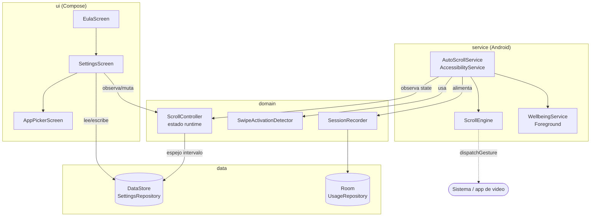
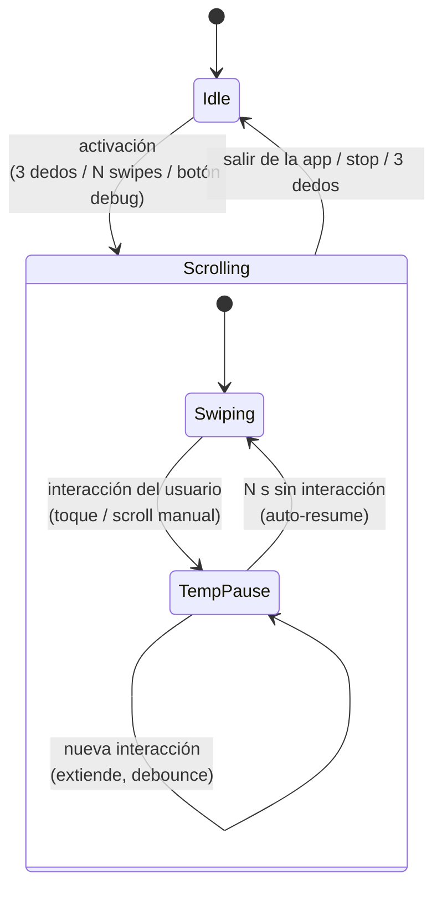
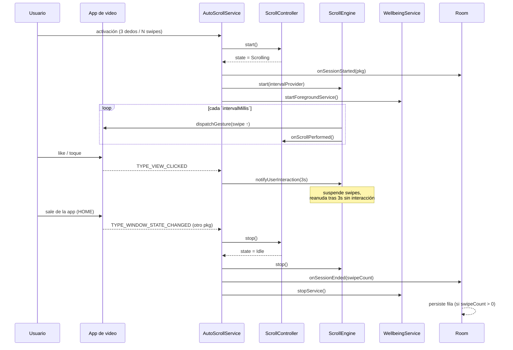

# Arquitectura — AutoScroller (Android)

Documentación técnica del módulo Android. Para *cómo usar* la app, ver el
[README](../../README.md); para *cómo testear*, ver [TESTING.md](../TESTING.md).

---

## 1. Visión general

AutoScroller es una app de **accesibilidad y bienestar digital** que automatiza el scroll
en feeds de video vertical (YouTube Shorts, TikTok, Reels). El núcleo es un
**`AccessibilityService`** que inyecta gestos de swipe a nivel sistema mediante
`dispatchGesture`, sin acceder a píxeles ni a la red.

**Stack:** Kotlin · Jetpack Compose + Material 3 · Hilt (DI) · Coroutines/Flow ·
DataStore (preferencias) · Room (historial de uso) · Navigation Compose.
AGP 9 / Gradle 9.5 / Kotlin 2.3 · minSdk 26 · target/compileSdk 36.

---

## 2. Capas y módulos

El código sigue una separación por responsabilidad (Clean Architecture pragmática):

```
com.freelanzer.autoscroller
├── core/            Infraestructura transversal
│   ├── di/          @ApplicationScope + CoroutineModule (scope de proceso)
│   ├── time/        Clock inyectable (wall-clock) → testeable en JVM
│   ├── apps/        InstalledAppsProvider (apps lanzables para la allowlist)
│   ├── service/     ServiceStatusProvider
│   └── ui/theme/    Tema Material 3 (dynamic color)
├── data/            Fuentes de datos (persistencia)
│   ├── settings/    SettingsRepository (interfaz) + DataStoreSettingsRepository
│   └── usage/       Room: Entity/Dao/Database + UsageRepository
├── domain/          Lógica de negocio pura (sin Android donde se puede)
│   ├── controller/  ScrollController (estado runtime) + ScrollState
│   ├── gesture/     SwipeActivationDetector (Kotlin puro)
│   └── usage/       SessionRecorder
├── service/         Servicios Android de larga vida
│   ├── accessibility/  AutoScrollService + ScrollEngine + status
│   └── wellbeing/      WellbeingService + WellbeingNotifier
└── ui/              Compose: eula/ settings/ apps/ navigation/
```

**Regla de dependencias:** `ui` y `service` dependen de `domain`/`data`; `domain` no
depende de Android salvo donde es inevitable. `ScrollController` y
`SwipeActivationDetector` son **Kotlin puro** (el timestamp se inyecta desde el caller), lo
que los hace testeables en JVM sin shadowear `SystemClock`.



---

## 3. Las dos fuentes de verdad

El diseño separa deliberadamente **estado runtime** de **persistencia**:

| | `ScrollController` (`@Singleton`) | `SettingsRepository` (DataStore) |
|---|---|---|
| Qué guarda | Estado efímero: `state` (Idle/Scrolling), `scrollCount`, `lastSwipeAtMs` | Preferencias persistentes: intervalo, límite, activadores, allowlist… |
| Vida | En memoria, scope de proceso | Disco (DataStore) |
| Quién lo muta | UI y `AutoScrollService` | UI (Ajustes) |
| Reinicia | `scrollCount`/`lastSwipeAtMs` en `start()` | nunca (es persistente) |

`ScrollController.intervalMillis` es un **espejo** de `SettingsRepository.intervalMillisFlow`
vía `stateIn(appScope, Eagerly)`, para que el servicio lea `.value` sin suspender. El
controller **no persiste** — esa responsabilidad es exclusiva del repositorio.

> No se usan broadcasts ni referencias estáticas entre UI y servicio: ambos observan/mutan
> el mismo `ScrollController` inyectado por Hilt.

---

## 4. Máquina de estados y pausa

El estado lógico es binario: **`Idle` ↔ `Scrolling`**. La *pausa por interacción* **no** es
un estado: vive dentro del `ScrollEngine` (suspende el bucle de swipes) y la sesión sigue
lógicamente `Scrolling`. Esto evita parpadeos de UI y mantiene viva la sesión de bienestar.



- **`ScrollEngine`** corre un bucle de coroutine: lee el intervalo **en cada tick**
  (`intervalProvider`), así un cambio de configuración aplica sin reiniciar. Cada swipe
  dispara `onScrollPerformed`.
- **Pausa:** `notifyUserInteraction(pauseMs)` setea `resumeAtMs = now + pauseMs`. El bucle
  espera y reevalúa; cada interacción extiende la ventana (debounce). Reanuda solo al
  expirar. Configurable `pauseOnTouchSeconds` (1–30, default 3).

---

## 5. Activación

| Mecanismo | Cómo | Disponibilidad | Default |
|---|---|---|---|
| **Tap 3 dedos** | `FLAG_REQUEST_MULTI_FINGER_GESTURES` + `onGesture(GESTURE_3_FINGER_SINGLE_TAP)` → `controller.toggle()` | API 30+, **device físico** (no simulable en emulador) | ON |
| **N swipes hacia arriba** | `SwipeActivationDetector` cuenta `TYPE_VIEW_SCROLLED` significativos dentro de una app de la allowlist | Feeds tipo `RecyclerView` (TikTok, Reels). **No** funciona en el player fullscreen de YouTube Shorts (no emite scrolled) | ON, 3 swipes |
| **Hook de debug** | `BroadcastReceiver` solo-debug (`E2E_START/STOP/INTERACT/DUMP/CLEAR`) | Solo build debug, para tests e2e por adb | — |

> **Decisión clave:** la spec original sugería un overlay `WindowManager` con `pointerCount==3`,
> pero ese enfoque bloquea/pasa-a-través de forma frágil y exige `SYSTEM_ALERT_WINDOW`. Se
> usó en cambio la API nativa de gestos multi-dedo del `AccessibilityService` — sin permiso
> de overlay, sin bloqueo de toques, gestión por el sistema.

---

## 6. Ciclo de una sesión



**Corte de sesión:** `hasLeftSessionApp()` solo evalúa `TYPE_WINDOW_STATE_CHANGED`; ignora
UI de sistema transitoria (`com.android.systemui`, `android`) y los saltos entre apps de la
allowlist. Salir al launcher u otra app no-video corta la sesión.

---

## 7. Bienestar digital

- **`WellbeingService`** (`LifecycleService` + Foreground `specialUse`): lo arranca/detiene
  `AutoScrollService` según el estado (start en `Scrolling`, stop en `Idle`). Usa
  `SystemClock.elapsedRealtime()` (monotónico), tick 10 s.
- **`WellbeingNotifier`** (`@Singleton`): centraliza canales (`IMPORTANCE_LOW` ongoing /
  `IMPORTANCE_HIGH` alerta al alcanzar el límite). `runCatching` para sobrevivir la ausencia
  del permiso `POST_NOTIFICATIONS`.
- **Persistencia de uso (Room):** `SessionRecorder` abre/cierra sesión y persiste
  `ScrollSessionEntity(startTime, endTime, swipeCount, appPackage)`. Sesiones de 0 swipes se
  descartan. Queries de agregación por app (`GROUP BY`) para las métricas.

---

## 8. UI y onboarding

Compose + Material 3, un solo `AppNavGraph` con rutas centralizadas en `AppRoutes`:

```
eula  ──(aceptar)──▶  settings  ──▶  app_picker
```

`MainActivity` resuelve el `startDestination` leyendo `eulaAcceptedFlow.first()` con
`runBlocking` (evita parpadeo). `SettingsScreen` es la pantalla principal post-onboarding
(secciones Auto-scroll / Bienestar / Activadores). Los ViewModels combinan los flows del
repositorio en un `UiState` inmutable; la validación de rangos vive en el repositorio.

---

## 9. Preferencias persistidas (DataStore)

| Clave | Tipo | Default | Rango |
|---|---|---|---|
| `interval_ms` | Long | 4000 | 1000–30000 |
| `time_limit_min` | Int | 30 | 5–180 |
| `alerts_enabled` | Bool | true | — |
| `three_finger_enabled` | Bool | **true** | — |
| `swipe_activation_enabled` | Bool | **true** | — |
| `required_swipes` | Int | 3 | 1–10 |
| `pause_on_touch_sec` | Int | 3 | 1–30 |
| `activation_apps` | Set\<String\> | YouTube/IG/TikTok/Facebook | editable |
| `eula_accepted` | Bool | false | — |

---

## 10. Privacidad

Todos los datos son **locales** (DataStore + Room en el almacenamiento privado de la app).
**No hay servidores ni red.** El `AccessibilityService` no procesa píxeles ni lee contenido
personal: solo observa tipos de evento (scroll/click/cambio de ventana) para orquestar el
auto-scroll y la pausa. Cualquier recopilación futura en nube sería opt-in con consentimiento
explícito (declarado en el EULA, sección "Datos y privacidad").

> El módulo **no tiene capa de red por diseño** — no hay dependencias de cliente HTTP.
